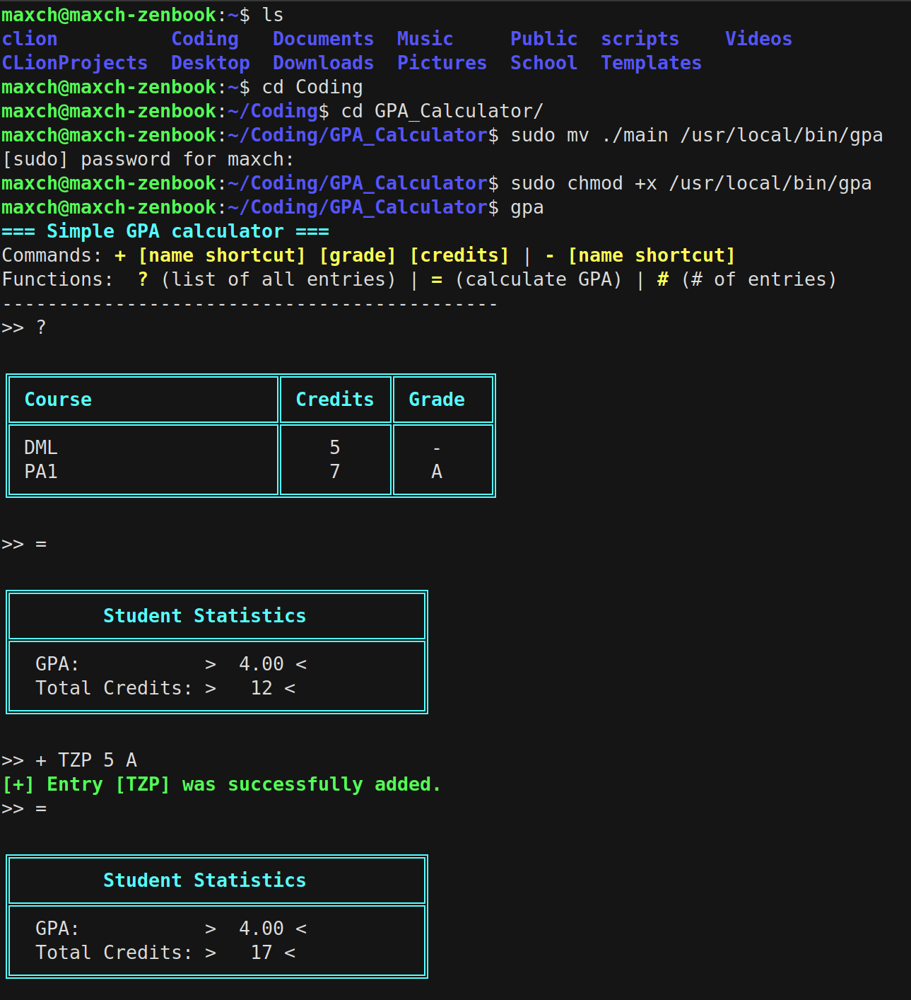

# GPA Calculator

A simple, command-line GPA (Grade Point Average) calculator written in C. This tool allows you to manage your course grades and calculate your GPA interactively with a clean terminal interface.



## Features

- **Add courses** with credits and (grades)
- **Remove courses** from your database
- **List all courses** in a formatted table
- **Calculate GPA** using standard grade point values from entries with grade
- **Calculate total credits** including entries with no grade
- **Persistent storage** - data is automatically saved locally to `./data.txt`

## Installation

### Compilation

```bash
g++ -Wall -pedantic -Wextra -fsanitize=address -g main.c -o main
```

### System-wide Installation (Optional)

To install the GPA calculator system-wide so you can run it from anywhere using the `gpa` command:

1. Compile the program (see above)

2. Move the executable `./main` to `/usr/local/bin/gpa`:
   ```bash
   sudo mv ./main /usr/local/bin/gpa
   ```

Now you can run the GPA calculator from any directory simply by typing:
```bash
gpa
```

**Note**: You may need `sudo` privileges to write to `/usr/local/bin`. If you prefer not to use `sudo`, you can install it to `~/bin` instead (create the directory first with `mkdir -p ~/bin`), but make sure `~/bin` is in your PATH.

## Usage

### Running Locally

If you installed the program system-wide, run it with:

```bash
gpa
```

If you compiled the program in the project directory, run it with:

```bash
./main
```

## Commands

| Command | Description | Example |
|---------|-------------|---------|
| `+` | Add a new course entry | `+ MATH101 3 A` |
| `-` | Remove a course entry | `- MATH101` |
| `?` | List all courses in a formatted table | `?` |
| `=` | Calculate and display current GPA | `=` |
| `#` | Show the number of entries | `#` |

### Command Format

- **Add entry**: `+ [course_name] [grade] [credits]`
  - `course_name`: Course identifier (up to 100 characters, no spaces)
  - `credits`: Number of credits (1-99)
  - `grade`: Single letter grade (A, B, C, D, E, or F) (optional, if not specified it won't be used to calculate GPA)

- **Remove entry**: `- [course_name]`
  - `course_name`: Course identifier to remove


## Data Storage

All course data is automatically saved to `data.txt` in the project folder, in the following format:

```
COURSE_NAME GRADE CREDITS
```
